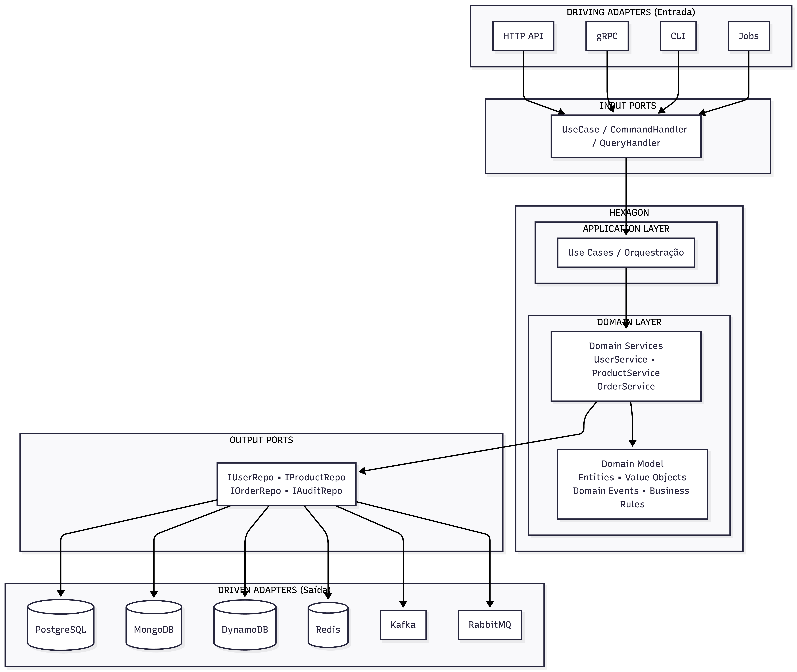

# Cactus Go Hexagonal Microservice Boilerplate

Framework de microsserviços em Go baseado em **Arquitetura Hexagonal** (Ports & Adapters) e **Domain-Driven Design**.

## Arquitetura Hexagonal

A **Arquitetura Hexagonal**, também conhecida como **Ports & Adapters**, foi proposta por Alistair Cockburn. O objetivo principal é criar aplicações fracamente acopladas onde a lógica de negócio (domínio) é completamente isolada das tecnologias externas.

### Conceitos Fundamentais



### Princípios da Arquitetura

| Princípio | Descrição |
|-----------|-----------|
| **Independência de Framework** | O domínio não depende de frameworks externos |
| **Testabilidade** | Regras de negócio testáveis sem UI, DB ou serviços externos |
| **Independência de UI** | A UI pode mudar sem alterar o domínio |
| **Independência de Banco** | PostgreSQL, MongoDB ou qualquer outro - o domínio não sabe |
| **Independência de Agentes Externos** | Regras de negócio não conhecem o mundo externo |

### Fluxo de Dados

```
Request HTTP -> Controller -> Use Case -> Domain Service -> Repository Interface
                                                                    |
                                                                    |
Response HTTP <- Controller <- Use Case <- Domain Service <- Repository Adapter
```

### Camadas do Projeto

| Camada | Pasta | Responsabilidade |
|--------|-------|------------------|
| **Domain** | `domain/` | Entidades, regras de negócio, eventos, interfaces de repositório |
| **Application** | `application/` | Use cases, orquestração, DTOs de entrada/saída |
| **Adapter** | `adapter/` | Implementações de repositórios, messaging, jobs |
| **API** | `api/` | Controllers HTTP, DTOs de request/response, middleware |
| **Config** | `config/` | Configurações da aplicação |

## Visão Geral do Sistema

Este projeto demonstra uma implementação completa de Arquitetura Hexagonal com um sistema de e-commerce contendo:

- **Users** - Gerenciamento de usuários (PostgreSQL)
- **Products** - Catálogo de produtos e estoque (MongoDB)
- **Orders** - Pedidos e itens (PostgreSQL)
- **Audit** - Log de auditoria de eventos (DynamoDB)

## Funcionalidades

### Arquitetura
- **Domain-Driven Design (DDD)** - Agregados, Entidades e Value Objects
- **Arquitetura Hexagonal** - Separação clara entre domínio, aplicação e adaptadores
- **Injeção de Dependência** - Google Wire para composição de dependências
- **Padrão Repository** - Abstração de acesso a dados com suporte a transações
- **Eventos de Domínio** - Sistema de eventos síncronos e assíncronos
- **CQRS** - Separação de comandos e consultas

### Infraestrutura
- **PostgreSQL** - Banco relacional para Users e Orders (via GORM)
- **MongoDB** - Banco de documentos para Products
- **DynamoDB** - NoSQL para logs de auditoria
- **Redis** - Cache distribuído
- **Kafka** - Streaming de eventos
- **RabbitMQ** - Fila de mensagens

### API
- **RESTful API** - Implementação com Gin framework
- **Validação** - Validação de requests com go-playground/validator
- **CORS** - Suporte a cross-origin requests
- **Métricas** - Prometheus para observabilidade
- **Logging** - Zap para logs estruturados
- **Tracing** - OpenTelemetry com Jaeger

### Observabilidade
- **OpenTelemetry** - Tracing distribuído com spans em services
- **Prometheus** - Métricas de aplicação e cache
- **Jaeger** - Visualização de traces distribuídos
- **Zap Logger** - Logs estruturados em JSON

### Caching
- **Redis** - Cache distribuído com decorator pattern
- **CachedUserService** - Cache de usuários com invalidação automática
- **CachedProductService** - Cache de produtos com invalidação automática
- **TTL configurável** - 30 minutos por padrão

### Error Handling Inteligente
- **DomainError** - Erros de domínio com HTTP status codes mapeados
- **Códigos de erro** - Respostas com códigos de erro identificáveis
- **Status apropriados** - 404 para não encontrado, 409 para conflito, etc.

## Estrutura do Projeto

```
.
├── adapter/                # Camada de Adaptadores
│   ├── amqp/               # Kafka e RabbitMQ producers/consumers
│   ├── dependency/         # Configuração de injeção de dependência (Wire)
│   ├── job/                # Tarefas agendadas
│   └── repository/         # Implementações de repositório
│       ├── dynamodb/       # Cliente e repositório DynamoDB
│       ├── mongo/          # Cliente e repositório MongoDB
│       ├── postgre/        # Repositórios PostgreSQL
│       └── redis/          # Cliente Redis e cache
├── api/                    # Camada de API
│   ├── dto/                # Data Transfer Objects
│   ├── http/               # Handlers HTTP e rotas
│   └── middleware/         # Middlewares (métricas, CORS, etc.)
├── application/            # Camada de Aplicação
│   ├── core/               # Interfaces base de Use Cases
│   ├── user/               # Use cases de User
│   ├── product/            # Use cases de Product
│   └── order/              # Use cases de Order
├── cmd/                    # Entry points da aplicação
├── config/                 # Configuração (Viper)
├── domain/                 # Camada de Domínio
│   ├── event/              # Eventos de domínio
│   ├── model/              # Modelos de domínio
│   ├── repo/               # Interfaces de repositório
│   └── service/            # Serviços de domínio
├── scripts/                # Scripts de inicialização
└── tests/                  # Utilitários de teste
```

## Começando

### Pré-requisitos
- Go 1.21+
- Docker e Docker Compose
- Make

### Instalação

```bash
# Clone o repositório
git clone https://github.com/RanchoCooper/cactus-golang-hexagonal-microservice-boilerplate.git
cd cactus-golang-hexagonal-microservice-boilerplate

# Inicialize o ambiente de desenvolvimento (macOS)
make init

# Inicie as dependências
docker-compose up -d

# Execute a aplicação
go run cmd/main.go
```

### Docker Compose

O docker-compose inclui:
- **PostgreSQL** - porta 5432
- **MongoDB** - porta 27017
- **Redis** - porta 6379
- **LocalStack** (DynamoDB) - porta 4566
- **Kafka** - porta 9092
- **Kafka UI** - porta 8090
- **RabbitMQ** - portas 5672 (AMQP), 15672 (Management)
- **Jaeger** - portas 16686 (UI), 4318 (OTLP HTTP)

```bash
# Iniciar todas as dependências
docker-compose up -d

# Verificar status
docker-compose ps

# Parar serviços
docker-compose down
```

## API Endpoints

### Users
| Método | Endpoint | Descrição |
|--------|----------|-----------|
| POST | /api/users | Criar usuário |
| GET | /api/users | Listar usuários |
| GET | /api/users/:id | Obter usuário |
| PUT | /api/users/:id | Atualizar usuário |
| DELETE | /api/users/:id | Excluir usuário |
| GET | /api/users/:id/orders | Listar pedidos do usuário |

### Products
| Método | Endpoint | Descrição |
|--------|----------|-----------|
| POST | /api/products | Criar produto |
| GET | /api/products | Listar produtos |
| GET | /api/products/:id | Obter produto |
| PUT | /api/products/:id | Atualizar produto |
| DELETE | /api/products/:id | Excluir produto |
| PATCH | /api/products/:id/stock | Atualizar estoque |

### Orders
| Método | Endpoint | Descrição |
|--------|----------|-----------|
| POST | /api/orders | Criar pedido |
| GET | /api/orders | Listar pedidos |
| GET | /api/orders/:id | Obter pedido |
| PATCH | /api/orders/:id/status | Atualizar status |
| POST | /api/orders/:id/cancel | Cancelar pedido |

## Configuração

A configuração é feita via `config/config.yaml` com suporte a variáveis de ambiente:

```yaml
env: dev
app:
  name: cactus-golang-hexagonal-microservice-boilerplate
  debug: true
  version: v1.0.0
http_server:
  addr: :8080
postgres:
  host: 127.0.0.1
  port: 5432
  user: postgres
  password: postgres
  database: go_hexagonal
mongodb:
  host: 127.0.0.1
  port: 27017
  database: go_hexagonal
dynamodb:
  endpoint: http://localhost:4566
  region: us-east-1
kafka:
  brokers:
    - localhost:9092
rabbitmq:
  host: 127.0.0.1
  port: 5672
```

### Variáveis de Ambiente

Override de configurações via variáveis com prefixo `APP_`:
- `APP_POSTGRES_HOST`
- `APP_MONGODB_HOST`
- `APP_DYNAMODB_ENDPOINT`
- `APP_KAFKA_BROKERS`
- `APP_RABBITMQ_HOST`

## Comandos de Desenvolvimento

```bash
# Formatar código
make fmt

# Executar linter
make ci.lint

# Executar testes
make test

# Executar todos os checks
make all
```

## CI/CD Pipeline

O projeto utiliza **GitHub Actions** para integração contínua com múltiplos jobs de validação.

### Visão Geral do Pipeline

```
┌─────────────┐     ┌─────────────────┐     ┌──────────────────────────┐
│ checkstyle  │────►│  build-and-test │────►│  docker-build            │
│ (lint)      │     │  (testes)       │     │  (build + security scan) │
└─────────────┘     └─────────────────┘     └──────────────────────────┘
       │
       │ (paralelo)
       ▼
┌─────────────┐
│    sast     │
│ (segurança) │
└─────────────┘
```

### Jobs do Pipeline

| Job | Descrição | Ferramentas |
|-----|-----------|-------------|
| **checkstyle** | Análise de qualidade de código | golangci-lint |
| **sast** | Análise de segurança estática | gosec, govulncheck |
| **build-and-test** | Compilação e testes unitários | go build, go test |
| **docker-build** | Build da imagem e scan de vulnerabilidades | Docker, Trivy |

### Checkstyle (golangci-lint)

Executa análise estática de código verificando:
- Erros não tratados
- Code smells
- Complexidade ciclomática
- Formatação e estilo
- Problemas de performance

```yaml
- name: Run golangci-lint
  uses: golangci/golangci-lint-action@v6
  with:
    version: latest
    args: --timeout=5m
```

### SAST (Static Application Security Testing)

#### Gosec
Scanner de segurança para Go que detecta:
- SQL Injection
- Command Injection
- Hardcoded credentials
- Weak cryptography
- Path traversal

#### govulncheck
Verifica vulnerabilidades conhecidas nas dependências do projeto.

```yaml
- name: Run Gosec Security Scanner
  uses: securego/gosec@master

- name: Run Go Vulnerability Check
  run: govulncheck ./...
```

### Docker Build & Security Scan

Build da imagem Docker multi-stage e scan de vulnerabilidades com Trivy:

```yaml
- name: Build Docker Image
  uses: docker/build-push-action@v6

- name: Run Trivy Vulnerability Scanner
  uses: aquasecurity/trivy-action@master
  with:
    severity: 'CRITICAL,HIGH'
```

### Relatórios de Segurança

Os resultados de segurança são enviados para o **GitHub Security** no formato SARIF:
- Gosec → `gosec-results.sarif`
- Trivy → `trivy-results.sarif`

Acesse em: **Repository → Security → Code scanning alerts**

### Permissões Necessárias

O workflow requer as seguintes permissões:

```yaml
permissions:
  contents: read
  security-events: write  # Para upload de SARIF
  actions: read
```

### Secrets Necessários

| Secret | Descrição | Obrigatório |
|--------|-----------|-------------|
| `CODECOV_TOKEN` | Token para upload de cobertura | Não (repos públicos) |

## Análise Estática de Código (golangci-lint)

O projeto utiliza **golangci-lint** para análise estática de código, similar ao Detekt para Kotlin. A configuração está em `.golangci.yml`.

### Linters Habilitados

| Categoria | Linters | Descrição |
|-----------|---------|-----------|
| **Bugs & Erros** | errcheck, govet, staticcheck, bodyclose, nilerr | Detecta erros não tratados e construções suspeitas |
| **Code Smells** | gocritic, revive, unconvert, unparam, wastedassign | Detecta code smells, conversões desnecessárias, parâmetros não utilizados |
| **Complexidade** | gocognit, gocyclo, funlen, nestif | Limita complexidade cognitiva/ciclomática, tamanho de funções e aninhamento |
| **Estilo** | gofmt, goimports, misspell, whitespace | Verifica formatação, imports e erros de ortografia |
| **Performance** | ineffassign | Detecta atribuições ineficientes |
| **Segurança** | gosec | Detecta problemas de segurança (SQL injection, hardcoded credentials, etc.) |

### Thresholds Configurados

| Métrica | Limite | Equivalente Detekt |
|---------|--------|-------------------|
| Complexidade Cognitiva | 30 | CognitiveComplexity |
| Complexidade Ciclomática | 15 | CyclomaticComplexMethod |
| Linhas por Função | 80 | LongMethod |
| Statements por Função | 50 | LongMethod |
| Profundidade de if's | 5 | NestedBlockDepth |

### Comandos

```bash
# Executar linter
make ci.lint

# Ou diretamente com golangci-lint
golangci-lint run ./...

# Com auto-fix (quando possível)
golangci-lint run ./... --fix

# Verificar arquivo específico
golangci-lint run ./path/to/file.go
```

### Instalação do golangci-lint

```bash
# macOS (via Homebrew)
brew install golangci-lint

# ou via Go
go install github.com/golangci/golangci-lint/cmd/golangci-lint@latest
```

## Observabilidade

### OpenTelemetry Tracing

O sistema utiliza OpenTelemetry para tracing distribuído, permitindo visualizar o fluxo de requisições através de todos os serviços.

**Configuração em `config.yaml`:**
```yaml
tracing:
  enabled: true
  endpoint: localhost:4318
  sampler: 1.0  # 0.0 a 1.0 (porcentagem de traces coletados)
```

**Acessar Jaeger UI:** http://localhost:16686

**Spans instrumentados:**
- `UserService.Create`, `UserService.Get`
- `ProductService.Create`, `ProductService.Get`
- `CachedUserService.*` (com atributos de cache hit/miss)
- `CachedProductService.*` (com atributos de cache hit/miss)

### Métricas Prometheus

**Endpoint:** http://localhost:9090/metrics

**Métricas disponíveis:**
- `http_requests_total` - Total de requisições HTTP
- `http_request_duration_seconds` - Latência de requisições
- `cache_hits_total{entity,status}` - Hits/misses de cache por entidade

### Redis Caching

O sistema implementa caching transparente usando o **decorator pattern**:

**Estratégia de cache:**
- **Cache-aside** - Leitura primeiro do cache, fallback para DB
- **Write-through** - Escrita no DB e cache simultaneamente
- **Invalidação automática** - Cache invalidado em Update/Delete
- **TTL** - 30 minutos por padrão

**Chaves de cache:**
- `user:{id}` - Dados do usuário
- `user:email:{email}` - Mapeamento email -> id
- `product:{id}` - Dados do produto
- `product:name:{name}` - Mapeamento name -> id

## Fluxo de Eventos e Auditoria

Quando uma entidade é criada/atualizada/excluída:
1. O serviço de domínio publica um evento
2. O evento é enviado para Kafka/RabbitMQ
3. O consumer de auditoria processa o evento
4. Um registro de audit é salvo no DynamoDB

```
User Created -> UserCreatedEvent -> Kafka -> AuditConsumer -> DynamoDB
```

## Error Handling Inteligente

O sistema utiliza erros de domínio tipados que são automaticamente mapeados para HTTP status codes apropriados.

### DomainError

```go
type DomainError struct {
    Code       string // Código identificável (ex: "USER_NOT_FOUND")
    Message    string // Mensagem amigável
    HTTPStatus int    // Status HTTP correspondente
}
```

### Mapeamento de Erros

| Erro | HTTP Status | Código |
|------|-------------|--------|
| `ErrUserNotFound` | 404 | USER_NOT_FOUND |
| `ErrUserEmailTaken` | 409 | EMAIL_TAKEN |
| `ErrUserEmailRequired` | 400 | VALIDATION_ERROR |
| `ErrUserEmailInvalid` | 400 | VALIDATION_ERROR |
| `ErrProductNotFound` | 404 | PRODUCT_NOT_FOUND |
| `ErrProductNameRequired` | 400 | VALIDATION_ERROR |
| `ErrInsufficientStock` | 409 | INSUFFICIENT_STOCK |
| `ErrOrderNotFound` | 404 | ORDER_NOT_FOUND |
| `ErrOrderInvalidStatus` | 400 | INVALID_STATUS |

### Exemplo de Resposta de Erro

```json
{
  "code": 0,
  "message": "user email is already taken",
  "data": {
    "error_code": "EMAIL_TAKEN"
  }
}
```

**Benefícios:**
- Clientes podem tratar erros pelo `error_code`
- Status HTTP semânticos (não mais 500 para erros de validação)
- Mensagens de erro consistentes


